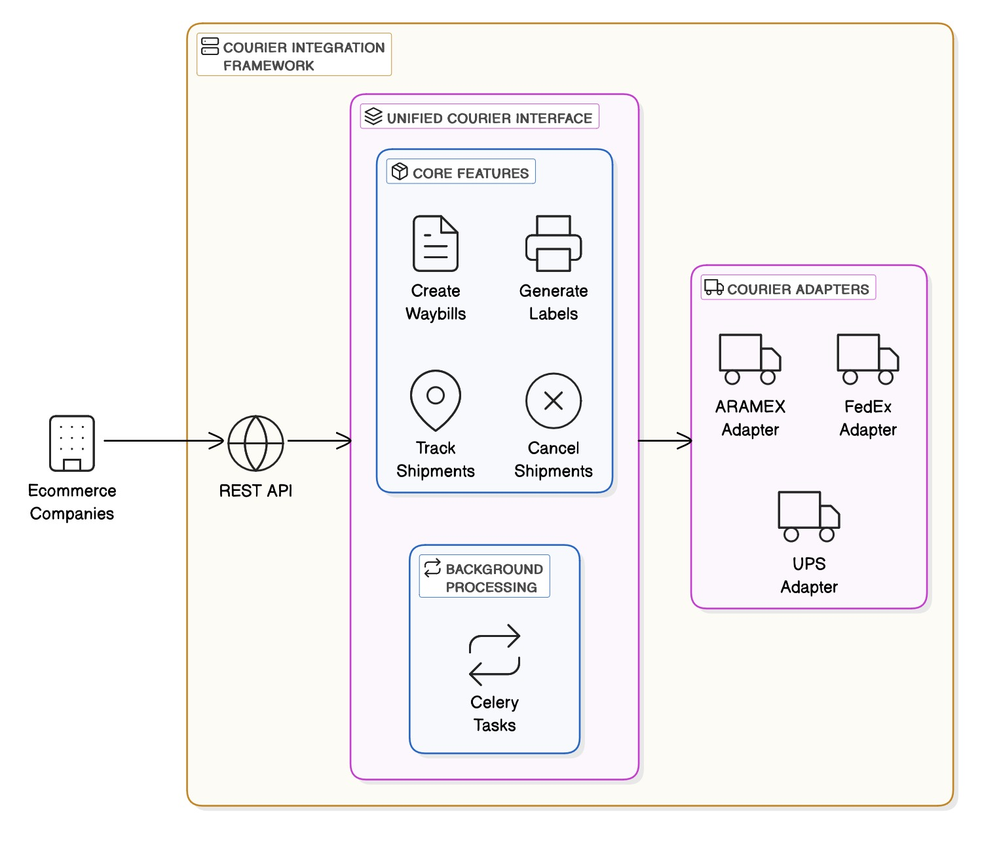

# 📦 Courier Integration Framework

A unified integration framework for multiple courier services built with **Django**, providing a consistent interface for creating waybills, generating labels, tracking shipments, and handling cancellations.



---

## ✨ Features

- 🔌 **Unified Courier Interface**: One common API for all couriers.
- 🧱 **Extensible Architecture**: Plug-and-play new courier adapters.
- ⚙️ **Core Functionalities**:
  - 📄 Create Waybills
  - 🖨️ Generate Labels
  - 📍 Track Shipments
  - ❌ Cancel Shipments (if supported)
- 🔁 **Status Standardization**: Maps courier-specific statuses to unified system statuses.
- 🧠 **Background Processing**: Scheduled tracking updates via Celery workers.
- 🌐 **REST API**: Easily integrable with external systems (e.g., eCommerce platforms).

---

## 🧠 Architecture Overview

### Design Patterns Used

- **Interface-Based Design**: All couriers implement a shared base interface.
- **Adapter Pattern**: Each courier adapter handles API translations.
- **Factory Pattern**: Dynamically loads courier adapters based on config.
- **Singleton Pattern**: Ensures only one instance of a courier class.

---

## 🚛 Supported Couriers

- ✅ **ARAMEX** (implemented as proof of concept)
- 🛠️ Easily extendable to FedEx, UPS, DHL, etc.

---

## 🛠️ Requirements

- Python 3.8+
- Django 3.2+
- PostgreSQL
- Redis (for Celery)

---

## 🚀 Getting Started

### 1. Clone the Repository

```bash
git clone https://github.com/milyasyousuf/zs-django-api.git
cd zs-django-api
```

### 2. Set Up Virtual Environment

```bash
python -m venv venv
source venv/bin/activate  # On Windows: venv\Scripts\activate
```

### 3. Install Dependencies

```bash
pip install -r requirements.txt/production.txt
```

### 4. Database Setup

```bash
python manage.py migrate
```

### 5. Create Superuser

```bash
python manage.py createsuperuser
```

### 6. Configure Couriers (see below)

### 7. Run the Server

```bash
python manage.py runserver
```

---

## ⚙️ Configuration

### Courier Mapping

```python
# settings.py

COURIER_MAPPING = {
    'aramex': 'zs.apps.courier_integrations.adapters.aramex.ARAMEXCourierAdapter',
    # Add more couriers as needed
}
```

### Courier Settings

```python
# settings.py

COURIER_CONFIG = {
    'ARAMEX': {
        'api_url': env('ARAMEX_API_URL', default='http://ws.aramex.net'),
        'username': env('ARAMEX_USERNAME', default="testingapi@aramex.com"),
        'password': env('ARAMEX_PASSWORD', default="R123456789$r"),
        'account_number': env('ARAMEX_ACCOUNT_NUMBER', default="20016"),
        'account_pin': env('ARAMEX_ACCOUNT_PIN', default="331421"),
        'account_entity': env('ARAMEX_ACCOUNT_ENTITY', default="AMM"),
        'account_country_code': env('ARAMEX_ACCOUNT_COUNTRY_CODE', default="JO"),
        'source': env('ARAMEX_SOURCE', default=24),
        'tracking_url': env('ARAMEX_TRACKING_URL', default='https://www.aramex.com/track/results'),
        'shipper_name': env('ARAMEX_SHIPPER_NAME', default="Test Shipper"),
        'shipper_company': env('ARAMEX_SHIPPER_COMPANY', default="Test Company"),
        'shipper_address_line1': env('ARAMEX_SHIPPER_ADDRESS_LINE1', default="Test Address Line 1"),
        'shipper_address_line2': env('ARAMEX_SHIPPER_ADDRESS_LINE2', default="Test Address Line 2"),
        'shipper_city': env('ARAMEX_SHIPPER_CITY', default="Amman"),
        'shipper_postal_code': env('ARAMEX_SHIPPER_POSTAL_CODE', default="11953"),
        'shipper_country_code': env('ARAMEX_SHIPPER_COUNTRY_CODE', default="JO"),
        'shipper_phone': env('ARAMEX_SHIPPER_PHONE', default="+962777777777"),
        'shipper_email': env('ARAMEX_SHIPPER_EMAIL', default="test@example.com"),
    },
}
```

> ⚠️ **Note:** I do not have access to actual Aramex credentials. All integration work is implemented with reference to their WSDL documentation:
>
> - [Tracking WSDL](https://ws.aramex.net/shippingapi/tracking/service_1_0.svc?wsdl)
> - [Shipping WSDL](https://ws.aramex.net/ShippingAPI.V2/Shipping/Service_1_0.svc?wsdl)

---

## 🔁 Celery Configuration

```python
# settings.py

CELERY_BROKER_URL = 'redis://localhost:6379/0'
CELERY_RESULT_BACKEND = 'redis://localhost:6379/0'
```

Start Celery Worker:

```bash
celery -A zs worker -l info
```

Start Celery Beat Scheduler:

```bash
celery -A zs beat -l info
```

---

## 🧪 Testing & Development

### Generate Test Data

```bash
python manage.py seed_courier_data
```

Or use Django Admin to manually add couriers and shipments.

### Run Tests

```bash
python manage.py test zs.apps.courier_integrations
```

---

## 🧩 Adding a New Courier Integration

1. Create a new adapter class:

```python
from zs.apps.courier_integrations.adapters.base import BaseCourierAdapter

class NewCourierAdapter(BaseCourierAdapter):
    def create_waybill(self, shipment_data): pass
    def print_waybill_label(self, waybill_id): pass
    def track_shipment(self, waybill_id): pass
    def cancel_shipment(self, waybill_id): pass

    def _get_status_mappings(self):
        return {
            "courier_status_1": "PENDING",
            "courier_status_2": "IN_TRANSIT",
        }
```

2. Register it in settings:

```python
COURIER_MAPPING['new_courier'] = 'zs.apps.courier_integrations.adapters.new_courier.NewCourierAdapter'
```

3. Create a DB entry:

```python
from zs.apps.courier_integrations.models.courier import Courier

Courier.objects.create(
    code='new_courier',
    name='New Courier Service',
    is_active=True,
    supports_cancellation=True
)
```

---

## 📦 API Endpoints

- `GET /api/couriers/`
- `POST /api/shipments/`
- `GET /api/shipments/{id}/`
- `POST /api/shipments/{id}/track/`
- `POST /api/shipments/{id}/cancel/`
- `GET /api/shipments/{id}/label/`

Sample Create:

```json
POST /api/shipments/
{
  "courier_code": "aramex",
  "reference_number": "REF123456",
  "customer_name": "Test Customer",
  "shipping_date": "2025-04-06",
  "destination_country": "UAE",
  "destination_city": "Dubai",
  "postal_code": "12345",
  "address_line1": "123 Test Street",
  "phone_number": "+9715012345678",
  "weight": 2.5
}
```

---

## 🏁 Production Deployment

- Set `DEBUG=False`
- Use PostgreSQL
- Run with Gunicorn + Nginx
- Celery with supervisor/systemd

---
